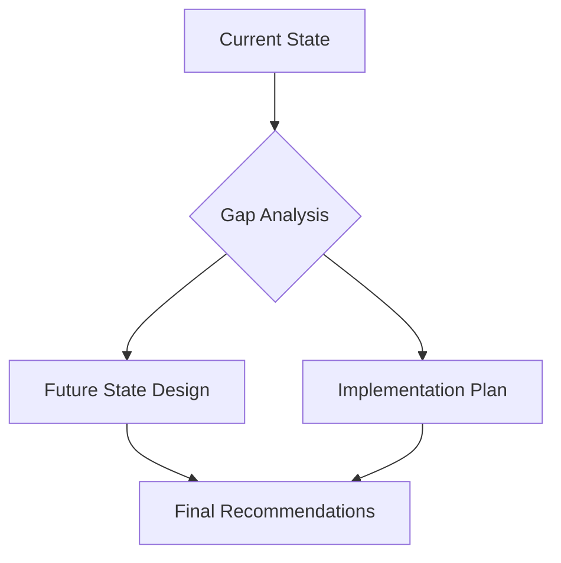

# STAG Documentation System

Repository for STAG (Strategy and Technology Advisory Group) documentation using Jekyll for offline viewing.

## Quick Start

```bash
# Clone the repository
git clone git@github.com:accionlabs/stag-notes.git
cd stag-notes

# Install dependencies
bundle install

# Auto-sync everything (one command does it all!)
./stag.sh

# Start Jekyll server
bundle exec jekyll serve
```

Visit [http://localhost:4000](http://localhost:4000) to view your documentation.

## How It Works

The STAG system automatically manages three types of content with intelligent team management:

| Folder | Repository Type | Purpose | Auto-Created |
|--------|----------------|---------|--------------|
| `_docs/private/` | `stag-private-[your-name]` | Personal methodologies and notes | ✅ Yes |
| `_docs/shared/` | `stag-shared` | Team resources and templates | ➕ If accessible |
| `_docs/projects/` | `stag-project-[project-name]` | Client work and deliverables | 🆕 Auto-created with team management |

## Prerequisites

- [Ruby](https://www.ruby-lang.org/en/documentation/installation/) and [Bundler](https://bundler.io/)
- [Jekyll](https://jekyllrb.com/docs/installation/)
- [GitHub CLI](https://cli.github.com/) (`gh`) - **Required**
- [jq](https://stedolan.github.io/jq/download/) - **Required** for JSON processing
- SSH access to GitHub
- Git configured with your name: `git config user.name "Your Name"`

### Installing Prerequisites

**macOS:**
```bash
# Install GitHub CLI and jq
brew install gh jq

# Install Ruby/Jekyll (if needed)
brew install ruby
gem install bundler jekyll
```

**Linux (Ubuntu/Debian):**
```bash
# Install GitHub CLI
sudo apt update
sudo apt install gh jq

# Install Ruby/Jekyll
sudo apt install ruby-full build-essential zlib1g-dev
gem install bundler jekyll
```

**Windows:**
- Download GitHub CLI from [cli.github.com](https://cli.github.com/)
- Download jq from [stedolan.github.io/jq](https://stedolan.github.io/jq/download/)
- Install Ruby from [rubyinstaller.org](https://rubyinstaller.org/)

## Team Management

The STAG system includes automatic team management for projects using a simple configuration approach.

### Team Configuration File

The system uses `.stag-team.json` in the base repository to map friendly names to GitHub usernames:

```json
{
  "team_members": {
    "saurabh": "saurabh-github-username",
    "hemesh": "hemesh-github-id", 
    "nischal": "nischal123",
    "karteek": "karteek-dev",
    "pankaj": "pankaj-consulting",
    "rahul": "rahul-stag",
    "ashutosh": "ashutosh-real-id"
  }
}
```

### Project Team Definition

Each project defines its team in the `index.md` front matter:

```yaml
---
title: "Alpha Strategy Project"
description: "Digital transformation strategy for Alpha Corp"
client: "Alpha Corp"
lead: "saurabh"
team: ["hemesh", "nischal", "karteek"]
status: "active"
start_date: "2025-01-15"
---
```

### Automatic Permission Management

- **Project Lead** (`lead`) → `admin` access to GitHub repository
- **Team Members** (`team`) → `push` access to GitHub repository
- **Permissions sync** automatically when `index.md` changes
- **Repository creation** happens automatically for new projects

## Creating a New Project

### 1. Create Project Folder and Index

```bash
# Create project directory
mkdir _docs/projects/alpha-strategy

# Create index.md with team information
cat > _docs/projects/alpha-strategy/index.md << 'EOF'
---
title: "Alpha Strategy Project"
description: "Digital transformation strategy for Alpha Corp"
client: "Alpha Corp"
lead: "saurabh"
team: ["hemesh", "nischal"]
status: "active"
start_date: "2025-01-15"
---

# Alpha Strategy Project

## Project Overview
Digital transformation strategy consulting for Alpha Corp.

## Team
- **Lead**: Saurabh
- **Team**: Hemesh, Nischal

## Project Structure
- [Proposal](proposal/) - Initial proposal and scope
- [Research](research/) - Background research and analysis
- [Presentations](presentations/) - Client presentations
- [Deliverables](deliverables/) - Final project outputs
EOF
```

### 2. Run Auto-Sync

```bash
./stag.sh
```

This will:
- ✅ Validate team members exist in `.stag-team.json`
- 🆕 Create GitHub repository `stag-project-alpha-strategy`
- 🔒 Set `saurabh` as admin, `hemesh` and `nischal` as collaborators
- 🔄 Add project to sync list
- 📁 Create basic project structure in repository

### 3. Start Working

The project is now ready:
- Local folder: `_docs/projects/alpha-strategy/`
- GitHub repo: `github.com/accionlabs/stag-project-alpha-strategy`
- Team permissions: Automatically managed
- Sync: Included in `./stag.sh` runs

## Commands

### Main Command
```bash
./stag.sh              # Auto-discover and sync everything
```

This single command:
- 🔍 **Discovers** all STAG repositories you have access to
- 🆕 **Creates** your private repository if it doesn't exist
- 🆕 **Creates** new project repositories with team management
- 🔒 **Syncs permissions** based on project `index.md` files
- 🔄 **Syncs** all content bidirectionally
- 📊 **Reports** what was synchronized

### Additional Commands
```bash
./stag.sh status       # Show current status and configuration
./stag.sh discover     # Force repository discovery (refresh cache)
./stag.sh help         # Show help message
```

## Managing Project Teams

### Updating Team Membership

To change project team members:

1. **Edit the project's `index.md`**:
   ```yaml
   ---
   title: "Alpha Strategy Project"
   lead: "saurabh"
   team: ["hemesh", "nischal", "karteek"]  # Added karteek
   ---
   ```

2. **Run sync**:
   ```bash
   ./stag.sh
   ```

3. **Permissions update automatically**:
   - `karteek` gets push access to the repository
   - All existing permissions remain unchanged

### Changing Project Lead

To change the project lead:

1. **Update the `lead` field**:
   ```yaml
   ---
   lead: "hemesh"  # Changed from saurabh to hemesh
   team: ["saurabh", "nischal", "karteek"]  # Add old lead to team if needed
   ---
   ```

2. **Run sync**:
   ```bash
   ./stag.sh
   ```

3. **Permissions transfer**:
   - `hemesh` gets admin access
   - `saurabh` gets push access (if in team array)

### Project Status Management

Use the `status` field to manage project lifecycle:

```yaml
---
status: "active"     # Active project (default permissions)
status: "on-hold"    # Temporarily paused
status: "completed"  # Finished project
status: "archived"   # Long-term storage
---
```

Note: Status doesn't currently affect permissions but can be used for reporting and organization.

## Getting Started

### 1. Initial Setup
```bash
# Configure git (required for auto-detection)
git config user.name "Your Name"
git config user.email "your.email@company.com"

# Authenticate with GitHub
gh auth login

# Clone and setup
git clone git@github.com:accionlabs/stag-notes.git
cd stag-notes
bundle install
```

### 2. First Sync
```bash
./stag.sh
```

This will:
- Create your private repository (`stag-private-[your-name]`)
- Link the shared repository (if you have access)
- Discover and link any project repositories you can access
- Set up the local folder structure

### 3. Start Creating Content

Create files and folders as needed:

```
_docs/
├── private/
│   ├── methodologies/
│   │   └── my-consulting-framework.md
│   ├── insights/
│   │   └── industry-trends-2025.md
│   └── client-notes/
│       └── relationship-mapping.md
├── shared/
│   ├── templates/
│   └── methodologies/
└── projects/
    ├── alpha-strategy/
    │   ├── index.md          # Required: Team and project info
    │   ├── proposal/
    │   ├── research/
    │   └── deliverables/
    └── beta-digital/
        ├── index.md          # Required: Team and project info
        └── presentations/
```

### 4. Regular Workflow

```bash
# Work on your documentation
# Edit files in _docs/private/, _docs/shared/, _docs/projects/

# Sync periodically (recommended: multiple times per day)
./stag.sh

# Start local server to preview
bundle exec jekyll serve
```

## Error Handling and Validation

### Project Validation Errors

**Missing `index.md`:**
```
❌ Project 'alpha-strategy' missing index.md - skipping
```
**Solution**: Create `index.md` with proper front matter

**Invalid team members:**
```
❌ Project alpha-strategy: Team member 'john' not found in team configuration
```
**Solution**: Add 'john' to `.stag-team.json` or use valid team member name

**Missing front matter:**
```
❌ Project 'alpha-strategy' has invalid index.md (no front matter) - skipping
```
**Solution**: Add YAML front matter with `---` delimiters

### Troubleshooting Team Configuration

**Team config file missing:**
```
⚠️  Team configuration file not found: .stag-team.json
ℹ️  Create it with: {"team_members": {"name": "github-username", ...}}
```
**Solution**: Contact admin to add team configuration to base repository

## Auto-Discovery Details

### Repository Detection

The script automatically:

1. **Identifies you** using `git config user.name`
2. **Scans GitHub** for repositories matching:
   - `stag-private-[your-name]` (creates if missing)
   - `stag-shared` (links if accessible)
   - `stag-project-*` (discovers all you can access)
3. **Validates local projects** for new project creation
4. **Caches results** for 1 hour (in `.stag-config.json`)
5. **Re-scans** when cache expires or when you run `./stag.sh discover`

### Smart Synchronization

For each repository:
- **Validates projects** with proper `index.md` and team info
- **Creates missing repositories** for new projects with valid teams
- **Syncs permissions** based on `index.md` team definitions
- **Pulls** latest changes from GitHub
- **Auto-resolves** merge conflicts (prefers remote changes)
- **Pushes** your local changes back to GitHub
- **Reports** sync status with colored output

### Conflict Resolution

When conflicts occur:
- ✅ **Auto-resolves** by preferring remote changes
- 📝 **Commits** resolution automatically
- ⚠️ **Warns** you about conflicts in output
- 🔄 **Continues** syncing other repositories

### Project Creation Workflow

When you create a new project folder:
1. **Validation**: Script checks for `index.md` with valid front matter
2. **Team validation**: Verifies all team members exist in `.stag-team.json`
3. **Repository creation**: Creates GitHub repository `stag-project-[name]`
4. **Permission setup**: Sets lead as admin, team as collaborators
5. **Sync integration**: Adds to repository sync list
6. **Content sync**: Includes in bidirectional synchronization

## Repository Types Explained

### Private Repository (`stag-private-[name]`)

**Purpose**: Your personal methodologies, insights, and confidential notes

**Auto-created**: Yes, if it doesn't exist

**Content suggestions**:
- Personal consulting frameworks
- Industry insights and observations
- Client relationship notes (confidential)
- Learning notes and reflections

### Shared Repository (`stag-shared`)

**Purpose**: Team resources, templates, and methodologies

**Access**: All STAG team members (if you're added to the team)

**Content suggestions**:
- Proposal templates
- Presentation templates
- Team methodologies and frameworks
- Industry research and analysis

### Project Repositories (`stag-project-[name]`)

**Purpose**: Client work and project deliverables

**Access**: Project team members only

**Content structure**:
- `proposal/` - Initial proposals and scope
- `research/` - Background research and analysis
- `presentations/` - Client presentations
- `deliverables/` - Final project outputs

## Markdown Best Practices

### Front Matter
Include YAML front matter in all markdown files:

```yaml
---
title: "Document Title"
description: "Brief description"
date: 2025-01-15
category: "methodology"
tags: ["consulting", "strategy"]
---
```

### Mermaid Diagrams
Include diagrams using fenced code blocks:



### Tables
Use markdown tables for structured data:

| Phase | Duration | Deliverable |
|-------|----------|-------------|
| Discovery | 2 weeks | Current state assessment |
| Analysis | 3 weeks | Gap analysis and recommendations |
| Planning | 2 weeks | Implementation roadmap |

## Security and Confidentiality

### Access Control

| Repository Type | Visibility | Who Can Access |
|----------------|------------|----------------|
| **Private** | Your eyes only | Individual consultant |
| **Shared** | Team-wide | All STAG team members |
| **Projects** | Project-specific | Assigned project team |

### Best Practices

- **Private content**: Keep client-specific and confidential information in your private repository
- **Shared content**: Only contribute general methodologies and non-confidential templates
- **Project content**: Ensure all team members are authorized before adding sensitive project information
- **Git history**: All changes are tracked - be mindful of what you commit

## Troubleshooting

### Common Issues

**"GitHub CLI not found"**
```bash
# Install GitHub CLI
brew install gh  # macOS
# or download from cli.github.com
```

**"jq not found"**
```bash
# Install jq
brew install jq  # macOS
sudo apt install jq  # Linux
```

**"Git user.name not set"**
```bash
git config user.name "Your Name"
```

**"Permission denied" for repositories**
- Check if you're added to the STAG team
- Contact admin to add you to specific projects
- Run `./stag.sh discover` to refresh permissions

**Sync conflicts**
- Conflicts are auto-resolved (remote changes preferred)
- Check `./stag.sh status` for any issues
- If needed, manually resolve in the `_docs/` folders

### Getting Help

**Check what's happening:**
```bash
./stag.sh status          # Current state
./stag.sh discover        # Refresh repository list
gh auth status            # GitHub authentication
git config user.name     # Your configured name
```

**Reset if needed:**
```bash
rm .stag-config.json      # Clear cache
./stag.sh discover        # Rediscover repositories
```

## Advanced Usage

### Manual Repository Management

While the auto-sync handles everything, you can still work with repositories manually:

```bash
# Navigate to documentation
cd _docs

# Check git status
git status

# Manual commit (auto-sync does this automatically)
git add .
git commit -m "Manual changes"

# Manual subtree operations (not recommended)
git subtree push --prefix=private git@github.com:accionlabs/stag-private-[name].git main
```

### Configuration File

The script maintains `.stag-config.json`:

```json
{
  "consultant": "john-smith",
  "last_scan": "2025-01-15T14:30:00Z",
  "repositories": {
    "private": "stag-private-john-smith",
    "shared": "stag-shared",
    "projects": ["stag-project-alpha-strategy", "stag-project-beta-digital"]
  }
}
```

- **Cache duration**: 1 hour
- **Auto-refresh**: When cache expires
- **Manual refresh**: `./stag.sh discover`

## Advanced Usage

### Manual Repository Management

While the auto-sync handles everything, you can still work with repositories manually:

```bash
# Navigate to documentation
cd _docs

# Check git status
git status

# Manual commit (auto-sync does this automatically)
git add .
git commit -m "Manual changes"

# Manual subtree operations (not recommended)
git subtree push --prefix=private git@github.com:accionlabs/stag-private-[name].git main
```

### Configuration Files

The script maintains several configuration files:

#### `.stag-config.json` (Auto-generated)
```json
{
  "consultant": "john-smith",
  "last_scan": "2025-01-15T14:30:00Z",
  "repositories": {
    "private": "stag-private-john-smith",
    "shared": "stag-shared",
    "projects": ["stag-project-alpha-strategy", "stag-project-beta-digital"]
  }
}
```

#### `.stag-team.json` (Admin-maintained)
```json
{
  "team_members": {
    "saurabh": "saurabh-github-username",
    "hemesh": "hemesh-github-id",
    "nischal": "nischal123"
  }
}
```

### Configuration Details

- **Cache duration**: 1 hour for repository discovery
- **Auto-refresh**: When cache expires or on `./stag.sh discover`
- **Team config**: Updated by admins, pulled automatically
- **Project validation**: Runs every sync to catch new projects