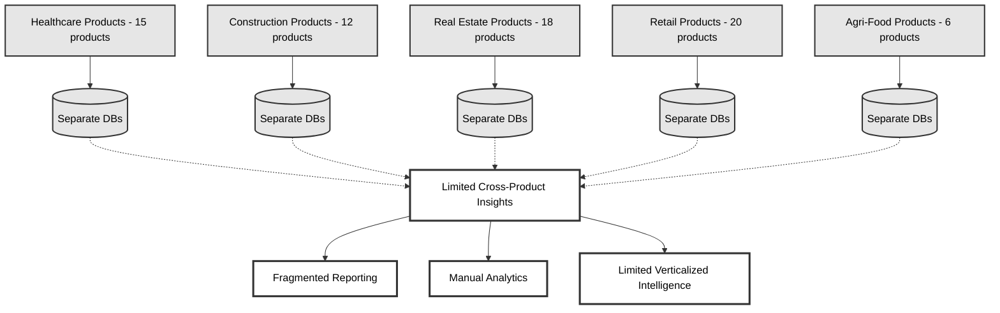
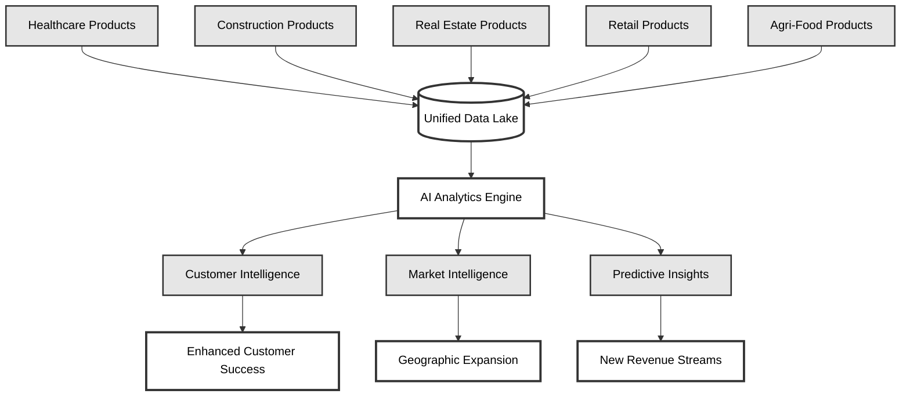
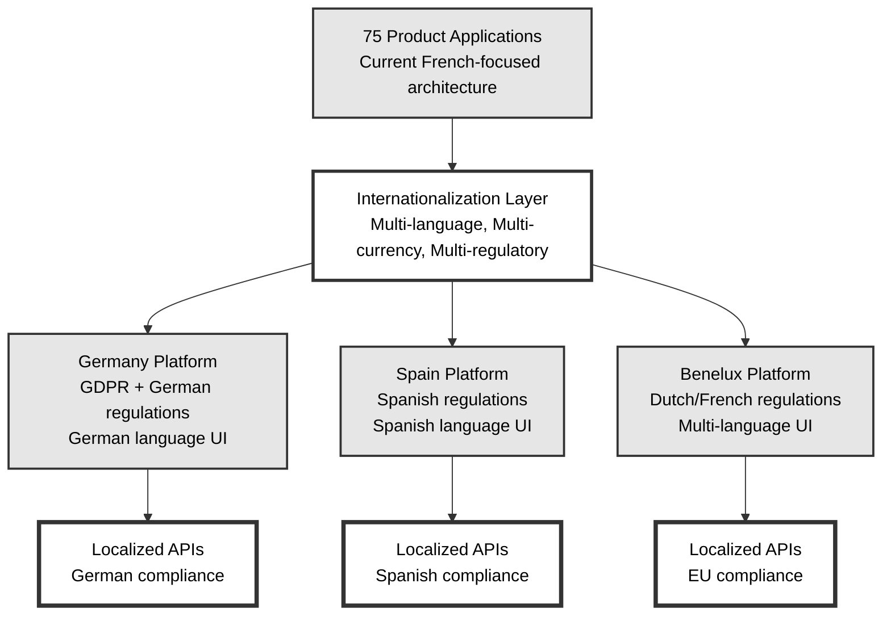
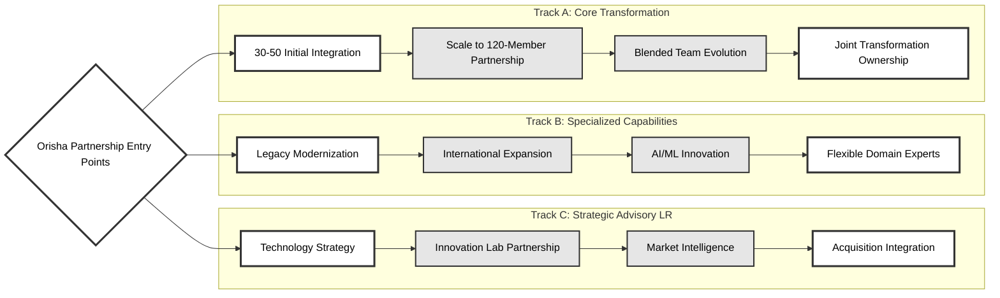

# Strategic Partnership Discussion: Accelerating Orisha's Transformation

## Executive Summary
**Orisha's Transformation**: 
- 75 products (€3.7M average revenue each) across 5 verticals, 
- maintaining €300M revenue and 50,000+ customer relationships during an ambitious 18-month modernization journey.

**Reality Check**: 
- Only 3% cloud adoption, 45% multi-tenant architecture, 
- with complex international expansion needs across French, Dutch, and Spanish-speaking markets.

**Partnership Opportunity**: 
- Collaborate to de-risk and accelerate transformation through shared expertise, complementary capabilities, and strategic alignment.

---

## Transformation Challenges We Can Address Together

### **1. Team Scaling Journey**
- **Current Situation**: 15-person tech team scaling to 120 in 18 months
- **Shared Recognition**: Orisha acknowledges collaborative approaches could be more effective than pure internal scaling
- **Execution Risks**: Knowledge gaps, cultural integration, execution velocity across rapid team growth
- **Partnership Approach**: Start with 30-50 experienced specialists, scale partnership presence as Orisha grows toward 120-member team, creating blended expertise throughout the organization

### **2. Customer Retention During Evolution**
- **Transformation Scope**: 75→40 product consolidation with end-of-life migration complexity
- **Customer Dynamics**: Modernization creates opportunity, end-of-life migrations create risk
- **Retention Challenge**: Avoiding customer defection during transitions from discontinued products
- **Collaborative Approach**: Develop migration strategies together, combining Orisha's customer knowledge with our transition experience

### **3. Technical Architecture Evolution**
- **Starting Point**: 3% cloud adoption across fragmented technology landscape
- **Destination**: Native APIs, microservices, cloud-native, AI-enabled platform
- **Complexity**: Massive architectural transformation while maintaining business continuity
- **Partnership Value**: Combine Orisha's domain expertise with our modernization experience from similar multi-acquisition environments

---

## Strategic Partnership Areas

## 🎯 **1. Data Consolidation & Intelligence Platform**

### **Current State: Fragmented Data Architecture**

### **Future State: Unified Intelligence Platform**

### **Immediate Value Creation**
- **Unified customer data lake** across all 71 products (3-6 month delivery)
- **Cross-vertical analytics** for customer insights and churn prevention
- **Industry intelligence platform** as new revenue stream (€5-10M potential)

### **Strategic Benefits**
- **Geographic expansion intelligence** for international market entry
- **Customer success optimization** through predictive analytics
- **Market opportunity identification** using aggregated customer patterns

### **Business Impact**
- 15-20% expansion revenue increase through better opportunity identification
- 5-10% customer retention improvement
- Foundation for €20-30M market intelligence business

---

## ☁️ **2. Cloud Transformation Collaboration**

### **Shared Execution Approach**
- **Blend capabilities**: Immediate cloud expertise integrated with Orisha's scaling timeline
- **Joint migration methodology**: Systematic product transitions combining both teams' strengths
- **Collaborative DevOps**: Proven infrastructure patterns adapted to Orisha's specific needs

### **Technical Partnership Model**
- **API-first architecture**: Co-develop shared services platform ("R entity")
- **Microservices evolution**: Gradual transition strategy for high-priority products
- **Unified security framework**: Collaborative approach to cross-product compliance

### **Mutual Value Creation**
- **Flexible partnership scaling**: Complement Orisha's hiring rather than replacing it
- **Knowledge exchange**: Transfer proven methodologies while learning Orisha's domain expertise
- **Sustainable capabilities**: Build internal expertise alongside external collaboration

---

## 🌍 **3. Platform Internationalization & Localization**

### **Technical Multi-Market Architecture**

### **Technical Partnership Approach**
- **Collaborative architecture**: Multi-tenant platform with region-specific compliance and deployment
- **Joint localization development**: Automated UI translation, currency conversion, and regulatory adaptation
- **Shared compliance framework**: Technical infrastructure for country-specific business rules and reporting
- **Integrated deployment**: Distributed architecture with regional data residency requirements

### **Partnership Capabilities**
- **Co-develop internationalization layer**: Abstract regional differences from 75 product codebases
- **Collaborative compliance engine**: Regulatory requirements handled as shared technical framework
- **Multi-language expertise**: Combine Orisha's market knowledge with our localization platform experience
- **Joint API development**: Regional gateways with localized authentication and business logic

### **Mutual Benefits**
- **Accelerated market readiness**: Platform-based approach vs. product-by-product internationalization
- **Shared compliance burden**: Centralized frameworks reducing individual product localization complexity
- **Knowledge combination**: Orisha's market insight + our internationalization platform experience
- **Technical efficiency**: Single internationalization layer supporting all products and future acquisitions

---

## 🚀 **4. Innovation & AI Collaboration**

### **Joint Technology Advancement**
- **Collaborative AI assessment**: Evaluate capabilities across Orisha's product portfolio together
- **Shared pilot development**: AI features using consolidated customer data from both perspectives
- **Co-create technology roadmap**: Emerging technology strategy combining market needs with technical possibilities

### **Partnership Innovation**
- **Joint prototyping**: New product development using unified platform
- **Shared market insights**: Opportunity identification through combined analytics
- **Collaborative pipeline**: Innovation management spanning both organizations

---

## Collaboration Framework

### **Three Parallel Partnership Tracks**

Our partnership can operate across three complementary tracks simultaneously, allowing Orisha to engage at different levels based on specific needs and priorities:

### **Track A: Core Transformation Partnership**
- **Initial integration**: 30-50 dedicated specialists as extended team members
- **Scaling partnership**: Collaborative growth toward the 120-member target team
- **Joint ownership** of critical transformation initiatives (data consolidation, cloud evolution)
- **Blended team model**: Partnership specialists integrated throughout Orisha's scaling journey
- **Shared accountability** for transformation milestones and customer retention
- **Knowledge transfer**: Continuous capability building as internal team grows

### **Track B: Specialized Capability Collaboration**
- **Domain expertise partnerships** for specific technical challenges
- **AS400/COBOL modernization** specialists for legacy transformation
- **International expansion** regulatory and localization expertise
- **AI/ML capabilities** for innovation initiatives
- **Flexible scaling** based on project phases and requirements

### **Track C: Strategic Advisory & Innovation**
- **Technology strategy collaboration** with CTO and architecture teams
- **Innovation lab partnership** for emerging technology exploration
- **Market intelligence development** using consolidated data insights
- **Acquisition integration** playbook development for future growth

### **Parallel Track Benefits:**
- **Flexible engagement**: Start with any track and expand based on success
- **Risk diversification**: Multiple collaboration points reduce dependency
- **Scalable partnership**: Adjust investment and focus across tracks as needed
- **Continuous value**: Each track delivers independent value while supporting others

### **Track Integration:**
- **Shared learnings** flow between all tracks
- **Resource flexibility** allows team members to contribute across tracks
- **Unified planning** ensures alignment without rigid boundaries
- **Progressive expansion** from pilot collaborations to deeper partnership

---

## Collaborative Discovery Timeline

### **Phase 1: Strategic Alignment Assessment (Month 1)**
- **Joint architecture review** across key products and shared technical visioning
- **Collaborative data consolidation study** with shared ROI development
- **Cloud transformation roadmap** developed together with integrated risk mitigation
- **International expansion opportunity exploration** for top 3 target markets

### **Phase 2: Partnership Proof of Value (Months 2-4)**
- **Data lake collaboration** with 3-5 products integrated as joint pilot
- **Customer analytics development** demonstrating shared insights capabilities
- **Cloud migration pilot** with collaborative approach on selected product
- **Market expansion framework** developed together for one vertical/geography

### **Phase 3: Strategic Partnership Evolution (Months 5+)**
- **Scale successful collaboration patterns** based on mutual proof of value results
- **Expand platform development** and migration collaboration
- **Joint international expansion** execution support
- **Ongoing innovation partnership** with shared technology exploration

---

## Partnership Differentiators

✅ **Strategic Collaboration Philosophy**: "Competent, integrated" partnership approach vs. traditional vendor relationships  
✅ **Multilingual Team Integration**: Address French, Dutch, Spanish language challenges collaboratively  
✅ **European Market Experience**: Navigate complex compliance across target markets together  
✅ **Legacy Modernization Partnership**: AS400, COBOL transformation with customer retention focus  
✅ **Distributed Collaboration Model**: Cost optimization through geographic skill combination  
✅ **Transparent Partnership**: White-box collaboration with shared ownership and mutual transparency  

---

## Partnership Outcomes

### **Year 1: Foundation & Collaborative Wins**
- Data consolidation delivering shared customer insights and analytics capabilities
- Cloud infrastructure collaboration with cost optimization and improved reliability
- Customer retention >95% during initial transitions through joint migration strategies

### **Year 2: Strategic Expansion Partnership**
- International market entry with validated, collaborative playbooks
- Product consolidation with minimal customer impact through shared expertise
- New revenue streams from market intelligence developed together

### **Year 3: Transformation Leadership**
- Modern, unified platform enabling rapid innovation through partnership
- International presence across target markets with shared market knowledge
- Platform ready for continued acquisition integration using proven collaboration patterns

---

## Next Steps

1. **Partnership Discovery Workshop**: Deep-dive into mutual capabilities and strategic alignment
2. **Collaborative Pilot Proposal**: Specific joint project with measurable shared outcomes
3. **Partnership Structure Definition**: Engagement model and shared success metrics
4. **Integrated Planning**: Detailed roadmap and collaborative resource planning

---

*Transform together. Scale with shared intelligence. Grow through partnership.*