---
layout:mermaid
mermaid: true
---
# Signal Product Analysis: Overview, Personas, and User Flows

## 1. High-Level Overview

### What is Signal?

Signal is Advise Technologies' solution for substantial shareholding disclosure. The software functions as a notification system for filing threshold violations based on market-enriched customer holding, security, portfolio, and trade files. The application also provides user-defined Warning thresholds that serve as an early warning system before a regulatory filing notification is required.

### Core Purpose and Target Users

Signal is designed for financial institutions, investment firms, and asset managers who need to comply with substantial shareholding disclosure regulations across multiple jurisdictions. The software helps these organizations monitor their holdings against regulatory thresholds, receive alerts when thresholds are approached or breached, and facilitate the required regulatory filing process.

### Key Functionality

Signal allows users to:

- Load and process data (holdings, securities, portfolios, trades) on an automated or ad-hoc basis
- Set custom Warning thresholds below regulatory filing thresholds
- Aggregate data as required by regulations and specific reporting structures
- View Warnings and Violations that occur after alerts are triggered
- View historical holdings, including previous Warnings and Violations
- Take actions on alerts (Acknowledge, Dismiss, Mark as Filed, or File)
- Access regulatory rules and key compliance information across jurisdictions
- View filing summary information per jurisdiction
- Proceed with the filing process for relevant regulatory authorities
- Automate email notifications to distribution lists

### Technical Architecture

Signal is a hosted web application that can be accessed via `signal.advisetechnologies.com`. The application appears to have:

- A daily data processing engine
- Rule evaluation systems
- Automated email notifications
- Regulatory filing generation capabilities
- Data visualization tools
- User management systems
- Customizable settings and configurations

## 2. Detailed Persona Profiles

### Persona Overview Table

| Attribute | Compliance Officer | System Administrator | Data Analyst / Operations Specialist |
|-----------|-------------------|----------------------|-----------------------------------|
| **Profile** | • Responsible for regulatory compliance • Mid to senior-level position • Daily engagement with Signal • Primary decision-maker for alerts • Coordinates with legal and investment teams | • Technical role for system configuration • Deep understanding of data structures • Occasional engagement for setup/maintenance • Primary contact for technical issues • Coordinates with data providers and IT | • Responsible for data operations and QA • Detail-oriented with focus on accuracy • Regular engagement for data loading • Works with compliance and investment teams • Handles data preparation and formatting |
| **Goals** | • Ensure timely and accurate filings • Avoid compliance violations • Maintain audit trail • Stay informed of regulatory changes • Manage daily compliance workflow | • Ensure proper system configuration • Maintain user access and permissions • Configure to match organizational needs • Troubleshoot technical issues • Optimize system performance | • Ensure accurate and timely data loading • Verify data quality and completeness • Investigate anomalies and exceptions • Support compliance activities • Maintain data history and records |
| **Pain Points** | • Managing multiple regulations • Tracking threshold levels and deadlines • Coordinating with stakeholders • Ensuring data accuracy • Maintaining documentation | • Managing data integration • Ensuring proper data mapping • Configuring complex aggregation rules • Troubleshooting data exceptions • Maintaining rule configurations | • Managing data from various systems • Formatting data to meet requirements • Identifying and resolving discrepancies • Maintaining data consistency • Tracking processing status |
| **Key Outcomes** | • Review/respond to alerts • Generate regulatory filings • Track compliance activities • Monitor threshold breaches • Access regulatory information • Document compliance actions • Configure warning thresholds | • Configure user access • Set up data mapping/translations • Configure warning thresholds • Manage filing identifiers • Set up email notifications • Maintain security lists • Troubleshoot data exceptions | • Load new data (manual/automated) • Monitor processing status • Investigate/resolve exceptions • View/export position data • Preview data before processing • Run ad-hoc rule analysis • Export activities and filing details |

### Persona 1: Compliance Officer

**Profile:**
- Responsible for ensuring regulatory compliance for shareholding disclosures
- Mid to senior-level position with knowledge of regulatory requirements
- Daily engagement with the Signal application
- Primary decision-maker for alert actions
- Coordinates with legal and investment teams on filing decisions

**Goals:**
- Ensure timely and accurate regulatory filings
- Avoid compliance violations and regulatory penalties
- Maintain an audit trail of compliance activities
- Stay informed of changing regulatory requirements
- Efficiently manage the daily compliance workflow

**Pain Points:**
- Managing multiple regulatory requirements across jurisdictions
- Tracking numerous threshold levels and filing deadlines
- Coordinating with various stakeholders on compliance matters
- Ensuring data accuracy and completeness
- Maintaining documentation for audit purposes

**Outcomes This Persona Can Achieve:**
1. Review and respond to daily alerts for potential filing requirements
2. Generate regulatory filings for relevant authorities
3. Track historical compliance activities and filings
4. Monitor approaching threshold breaches via Warning alerts
5. Access regulatory information for informed decision-making
6. Document compliance actions and decisions
7. Configure warning thresholds for early notification

### Persona 2: System Administrator

**Profile:**
- Technical role responsible for Signal system configuration and maintenance
- Has deeper understanding of data structures and system integration
- Occasional engagement with the application for setup and maintenance
- Primary contact for technical issues and configuration changes
- Coordinates with data providers and IT teams

**Goals:**
- Ensure proper system configuration and data mapping
- Maintain user access and permissions
- Configure system settings to match organizational needs
- Troubleshoot technical issues
- Optimize system performance

**Pain Points:**
- Managing data integration from multiple sources
- Ensuring proper data mapping and translations
- Configuring complex aggregation rules
- Troubleshooting data exceptions and errors
- Maintaining up-to-date rule configurations

**Outcomes This Persona Can Achieve:**
1. Configure user access and permissions
2. Set up data mapping and translations
3. Configure rule warning thresholds
4. Manage jurisdictional filing identifiers
5. Set up email notification rules
6. Load and maintain custom security lists
7. Troubleshoot data exceptions and errors

### Persona 3: Data Analyst / Operations Specialist

**Profile:**
- Responsible for daily data operations and quality assurance
- Detail-oriented with focus on data accuracy
- Regular engagement with the application for data loading and verification
- Works closely with compliance and investment teams
- May be responsible for data preparation and formatting

**Goals:**
- Ensure accurate and timely data loading
- Verify data quality and completeness
- Investigate data anomalies and exceptions
- Provide support for compliance activities
- Maintain data history and records

**Pain Points:**
- Managing data from various internal systems
- Formatting data to meet Signal requirements
- Identifying and resolving data discrepancies
- Maintaining data consistency across systems
- Tracking daily data processing status

**Outcomes This Persona Can Achieve:**
1. Load new data into the system (manual and automated)
2. Monitor data processing status and results
3. Investigate and resolve data exceptions
4. View and export position data
5. Preview data before rule processing
6. Run ad-hoc rule analysis on specific data sets
7. Export activities and filing details for reporting

## 3. User Flows & Dependencies

### User Flow Overview Table

| Persona | Flow Name | Business Context | Description | Key Steps | Complexity |
|---------|-----------|-----------------|-------------|-----------|------------|
| **Compliance Officer** | Daily Alert Review and Response | Triggered by holdings approaching or crossing regulatory thresholds that require disclosure | Core daily workflow for monitoring and responding to alerts | 1. Receive notification 2. Review alerts 3. Take action on each alert 4. Document decisions | Medium |
| **Compliance Officer** | Filing Process | Triggered when a regulatory filing obligation has been confirmed and must be submitted within required timeframes | Creating and submitting regulatory filings | 1. Generate filing 2. Review and complete 3. Submit to regulator 4. Update system status | Medium |
| **Compliance Officer** | Accessing Regulatory Information | Triggered when specific regulatory requirements need to be understood for compliance decisions | Reviewing regulatory details for compliance decisions | 1. Access Rules section 2. Locate specific rule 3. Review regulatory info 4. Check filing requirements | Low |
| **Compliance Officer** | Exporting Activity and Filing Details | Triggered when reports on filing activities and current disclosure obligations are needed | Generating reports on compliance activities | 1. Export from Alert Summary 2. Select report type 3. Set filters 4. Generate report | Low |
| **System Administrator** | User Management | Triggered by changes to the team of users who need access to the system | Adding, editing, and removing users | 1. Access user management 2. Select action (add/edit/remove) 3. Configure details 4. Save changes | Low |
| **System Administrator** | Data Mapping Configuration | Triggered by changes to how the organization's data needs to be interpreted by the system | Setting up how data maps to Signal structure | 1. Access mapping interface 2. Select columns to map 3. Define mappings 4. Verify configuration | High |
| **System Administrator** | Managing Translations | Triggered by inconsistencies between internal data values and standardized values required by Signal | Configuring value translations between systems | 1. Access translation management 2. Select column to translate 3. Define value mappings 4. Save translations | Medium |
| **System Administrator** | Configuring Rule Warnings | Triggered when the organization needs to adjust its risk tolerance for approaching regulatory thresholds | Setting up warning thresholds for early notification | 1. Access warning maintenance 2. Select rule to configure 3. Set threshold values 4. Save configuration | Medium |
| **System Administrator** | Setting Up Email Notifications | Triggered when automated communication channels for compliance alerts need to be established or modified | Configuring automated alert notifications | 1. Access notification setup 2. Define recipients and triggers 3. Set notification details 4. Save configuration | Low |
| **Data Analyst** | Loading New Data | Triggered when new position or reference data needs to be imported outside automated processes | Manually importing data for analysis | 1. Access data loading 2. Select files to upload 3. Define data parameters 4. Execute load | Medium |
| **Data Analyst** | Running Ad-hoc Rule Analysis | Triggered by need to evaluate data against specific rules outside regular processing | Triggering rule evaluation on specific data | 1. Initiate analysis 2. Select data and rules 3. Execute analysis 4. Review results | Low |
| **Data Analyst** | Previewing Data | Triggered by need to examine holdings evaluated against rules for verification or investigation | Viewing holdings evaluated against rules | 1. Access data preview 2. Select rule and date 3. Review holdings data 4. Export if needed | Low |
| **Data Analyst** | Investigating Exceptions | Triggered when system identifies data quality issues preventing proper rule evaluation | Identifying and resolving data issues | 1. Locate exceptions 2. Analyze error reasons 3. Correct data issues 4. Re-process data | High |

### Compliance Officer Flows

#### Flow 1: Daily Alert Review and Response
**Business Context:** This flow is triggered when the firm's holdings in a security approach or cross regulatory thresholds that require disclosure. The Compliance Officer receives notification that the overnight or intraday data processing has generated alerts that need attention. These alerts could be triggered by various business events such as:
- New investments by portfolio managers exceeding disclosure thresholds
- Increased positions due to market movements affecting percentage holdings
- Corporate actions affecting ownership percentages (stock splits, buybacks)
- Accumulated small trades across multiple funds reaching a reportable level
- Positions decreasing below thresholds where exit notifications are required

**Description:** The core daily workflow for monitoring and responding to alerts generated by the system.

**Steps:**
1. Receive email notification when daily rule processing is complete
2. Log into Signal application
3. View Dashboard for recent activity overview
4. Navigate to Alert Summary UI to view generated alerts
5. Review each Alert Detail by clicking on the number of records
6. Take appropriate action on each alert:
   - Acknowledge (alert will re-fire until further action)
   - Dismiss (alert will not re-fire until next threshold breach)
   - Mark as Filed (for externally filed notifications)
   - File (for notifications that can be filed through Signal)
7. Add comments and attachments as needed for documentation

**User Dependencies (Information/Preparation Required):**
- Knowledge of organizational filing procedures and policies
- Understanding of regulatory requirements for different jurisdictions
- Decision-making authority for alert disposition
- Access credentials for Signal application
- Familiarity with internal documentation requirements

**System Dependencies:**
- Completed data loading and rule processing
- Functioning email notification system
- Access to Alert Summary UI
- Alert data storage and retrieval systems
- Action tracking and audit trail functionality
- Document attachment capabilities

**Technical Considerations:**
- Email notification system integration
- Alert data storage and retrieval
- Action tracking and audit trail
- Document attachment capabilities

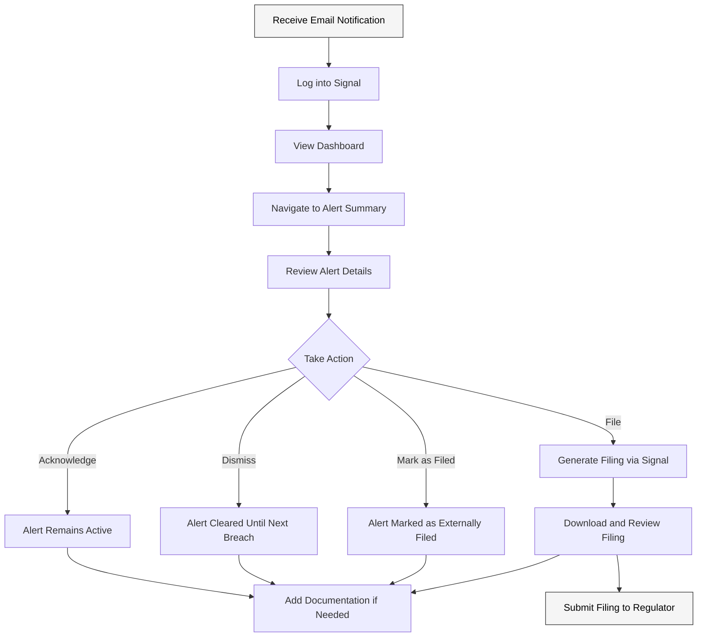

#### Flow 2: Filing Process
**Business Context:** This flow is triggered when a regulatory filing obligation has been confirmed and must be fulfilled within the required timeframe. The Compliance Officer needs to submit a notification to the appropriate regulatory authority. Business events that necessitate this flow include:
- Initial substantial shareholding notifications (first time crossing a threshold)
- Changes in substantial shareholding (crossing higher or lower thresholds)
- Ceasing to be a substantial shareholder (falling below minimum threshold)
- Short position disclosures exceeding regulatory limits
- Responses to regulator inquiries about position holdings
- Periodic position reporting requirements (in some jurisdictions)
- Takeover panel-related position disclosures during M&A activity

**Description:** The process of creating and submitting a regulatory filing based on an alert.

**Steps:**
1. From Alert Detail Data window, click "File" button
2. Enter internal comment and click OK
3. Download the pre-populated filing template
4. Open the template to review automatically populated data
5. Add any additional required information
6. Save the filing to desired location
7. Submit the notification to the appropriate regulator
8. Return to Signal and verify the alert is marked as "Filed"

**User Dependencies (Information/Preparation Required):**
- Knowledge of specific jurisdiction's filing requirements
- Understanding of what additional information may be needed
- Authority to submit regulatory filings
- Contact information or submission process for regulatory authorities
- Internal documentation requirements for filing records

**System Dependencies:**
- Configured Jurisdictional Filing Identifiers
- Available templates for the specific jurisdiction
- Alert must be active in the system
- Connection to download the template
- Storage system for completed filings

**Technical Considerations:**
- Template generation and population
- Filing metadata storage
- Status tracking after filing
- Potential for direct regulatory submission integration

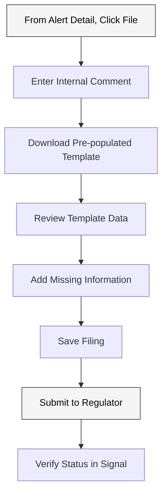

#### Flow 3: Accessing Regulatory Information
**Business Context:** This flow is triggered when the Compliance Officer needs to understand specific regulatory requirements to make informed compliance decisions. The business events that might prompt this flow include:
- Receiving a new alert for a jurisdiction they're less familiar with
- Questions from portfolio managers about trading restrictions
- Planning for entry into new markets or new security types
- Changes in regulatory requirements announced by authorities
- Internal compliance reviews and updates to procedures
- Training new team members on regulatory requirements
- Responding to internal audit or external regulator inquiries
- Preparing for cross-border transactions with multiple filing requirements

**Description:** Process for reviewing regulatory details to inform compliance decisions.

**Steps:**
1. Navigate to Rules section from top toolbar
2. Locate the relevant rule by filtering or searching
3. Click "Details" in the Actions column
4. Review rule information, including:
   - Related rules
   - Key regulatory points
   - Default variation
   - Other variations
5. Click "Filing Summary" to view registration and filing requirements
6. Review registration prerequisites, filing deadlines, and form sources

**User Dependencies (Information/Preparation Required):**
- Knowledge of which rule applies to the current situation
- Understanding of regulatory terminology
- Ability to interpret regulatory requirements
- Need for specific filing information

**System Dependencies:**
- Up-to-date regulatory information in the system
- Access to Rules section
- Search and filter functionality
- Relationship mapping between related rules

**Technical Considerations:**
- Regulatory data management and updates
- Search and filter capabilities
- Relationship mapping between related rules

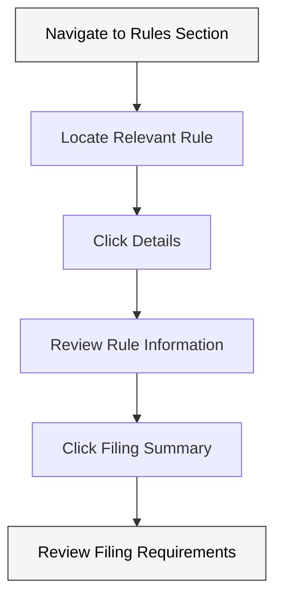

#### Flow 4: Exporting Activity and Open Filing Details
**Business Context:** This flow is triggered when the Compliance Officer needs to generate reports on filing activities and current disclosure obligations. Business events that necessitate this reporting include:
- Periodic compliance reporting to senior management
- Regulatory examinations or audits requiring documentation
- Internal compliance reviews to ensure all filings are up-to-date
- Due diligence requests during corporate transactions
- Quarterly/annual compliance committee meetings
- Creating an inventory of active disclosure obligations
- Handover of responsibilities between team members
- Analysis of filing activities to optimize compliance processes
- External auditor requests for compliance documentation

**Description:** Process for generating reports on compliance activities and open filing obligations.

**Steps:**
1. Navigate to Alert Summary UI
2. Click "Export Activity" in the upper right
3. Select either:
   - Open Filings Only (for active disclosure notifications)
   - Activity Information (for historical activity)
4. Set filters as needed:
   - Select jurisdiction(s)
   - Choose date range (for Activity Information)
   - Include audit details if needed
   - Include alert details if needed
   - Filter by module (Substantial Shareholding or Position Limits)
   - Filter by issuer name if needed
5. Click "Export" to generate the report
6. Receive email with report or download directly

**User Dependencies (Information/Preparation Required):**
- Knowledge of reporting requirements
- Understanding of what information needs to be included
- Specific date ranges for historical data
- Filtering criteria (jurisdictions, issuers, etc.)
- Report recipient information if needed

**System Dependencies:**
- Historical data availability and retention
- Email system for report delivery
- Export functionality with filtering capabilities
- Report generation processor
- CSV handling capability

**Technical Considerations:**
- Report generation performance
- Data query and filtering capabilities
- Export format standardization (CSV)

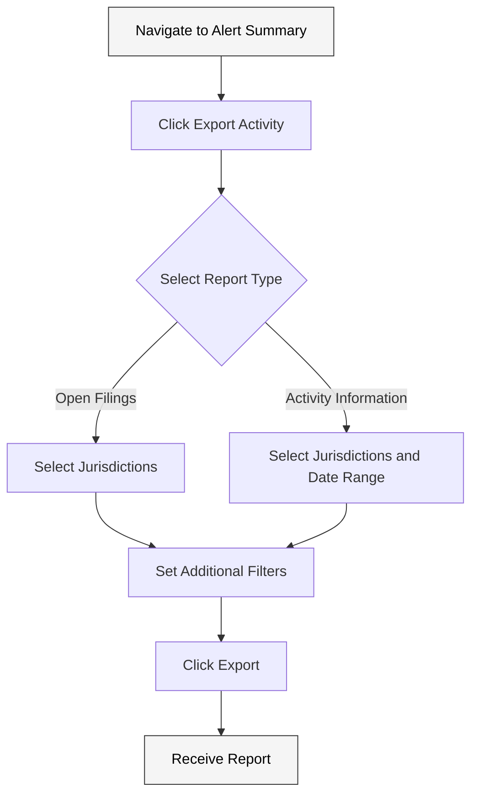

### System Administrator Flows

#### Flow 1: User Management
**Business Context:** This flow is triggered when there are changes to the team of users who need access to the Signal system. Business events that prompt this activity include:
- Onboarding new compliance officers or analysts
- Role changes requiring different permission levels
- Departures of staff members necessitating access removal
- Organizational restructuring affecting user responsibilities
- Implementation of segregation of duties requirements
- Regular user access reviews (quarterly/semi-annual)
- Security audits requiring access verification
- Changes to compliance oversight structure requiring new approvers
- Temporary access requirements for consultants or auditors

**Description:** Process for adding, editing, and removing users from the system.

**Steps:**
1. Navigate to Tools menu in upper right
2. Select "Manage Users"
3. To add a new user:
   - Click "Add User"
   - Enter user details and permissions
   - Save changes
4. To edit a user:
   - Select the user
   - Click "Edit"
   - Update details or permissions
   - Save changes
5. To remove a user:
   - Select the user
   - Click "Delete"
   - Confirm deletion

**User Dependencies (Information/Preparation Required):**
- New user information (name, email, role, etc.)
- Understanding of permission levels needed for different roles
- Knowledge of organizational access policies
- Authorization to add/modify/remove users
- Internal approval process for user access changes

**System Dependencies:**
- Administrative permissions
- User management module
- Authentication system
- Authorization framework
- User audit logging

**Technical Considerations:**
- User authentication and authorization
- Permission management
- Audit trail for user changes

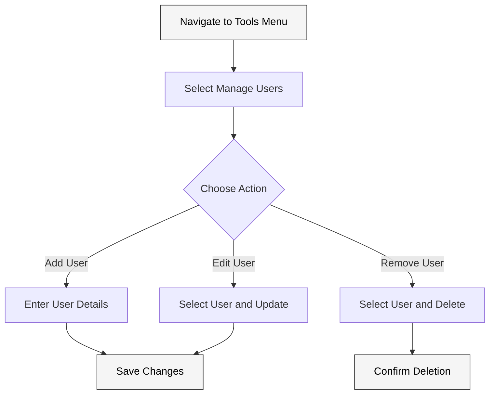

#### Flow 2: Data Mapping Configuration
**Business Context:** This flow is triggered when there are changes to how the organization's data needs to be interpreted by the Signal system. Business events that necessitate data mapping configuration include:
- Initial implementation of the Signal system
- Changes to upstream data sources or formats
- Integration of new portfolio management systems
- Migration to new trading platforms
- Mergers or acquisitions requiring data consolidation
- Addition of new fund structures or legal entities
- Implementation of new identifier systems (ISIN, CUSIP, etc.)
- Changes to internal data warehousing architecture
- Refinement of data mapping to improve processing accuracy
- Regulatory changes requiring new data fields or formats

**Description:** Process for configuring how imported data maps to Signal's data structure.

**Steps:**
1. Navigate to My Data section
2. Click "Load New Data"
3. Click "Map My Data"
4. In the Mapping window:
   - Select the desired column
   - Select the Data Type
   - Select the Column
   - Click "Set Mapping"
5. Repeat for each column that needs mapping
6. Test mapping with sample data if needed

**User Dependencies (Information/Preparation Required):**
- Detailed knowledge of client data structure and formats
- Understanding of Signal's data requirements
- Sample data files for testing mappings
- Documentation of data fields and their meanings
- Knowledge of data relationships and hierarchies

**System Dependencies:**
- Administrative permissions
- Data mapping module
- Sample data loading capability
- Mapping validation system
- Configuration persistence

**Technical Considerations:**
- Data mapping persistence
- Validation of mapping configurations
- Impact on existing data processing
- Potential for mapping conflicts

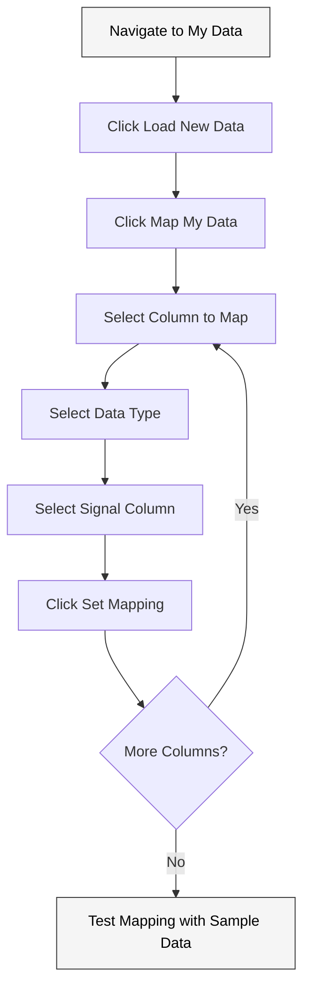

#### Flow 3: Managing Translations
**Business Context:** This flow is triggered when there are inconsistencies between the organization's internal data values and the standardized values required by Signal. Business events that prompt translation management include:
- Implementation of new security type classifications
- Changes to internal coding systems for financial instruments
- Addition of new exchanges or trading venues
- Integration of acquired company's security coding systems
- Standardization initiatives for data consistency
- New regulatory reporting categories requiring mapping
- Regional expansion introducing new market-specific codes
- Identification of data misclassifications in exception reports
- Periodic data quality reviews identifying translation gaps
- Changes to vendor market data taxonomies

**Description:** Process for configuring translations between client data values and Signal's expected values.

**Steps:**
1. Navigate to Tools menu
2. Select "Manage Translations"
3. Select the column to translate (from client data)
4. View the Signal Rule Column it will map to
5. To create a new translation:
   - Click "Create/Edit Translations"
   - Add Original Value (client data)
   - Add Translated Value (Signal format)
   - Save changes
6. To edit existing translations:
   - Select the translation
   - Click "Edit"
   - Update values
   - Save changes

**User Dependencies (Information/Preparation Required):**
- Comprehensive list of client data values
- Knowledge of Signal's standardized value formats
- Understanding of data meaning and equivalences
- Documentation of coding systems or taxonomies
- Mapping between different classification systems

**System Dependencies:**
- Translation management module
- Administrative permissions
- Configuration persistence
- Value validation system
- Fallback handling for untranslated values

**Technical Considerations:**
- Translation rule persistence
- Validation of translation rules
- Handling of unmapped values
- Impact on existing data processing

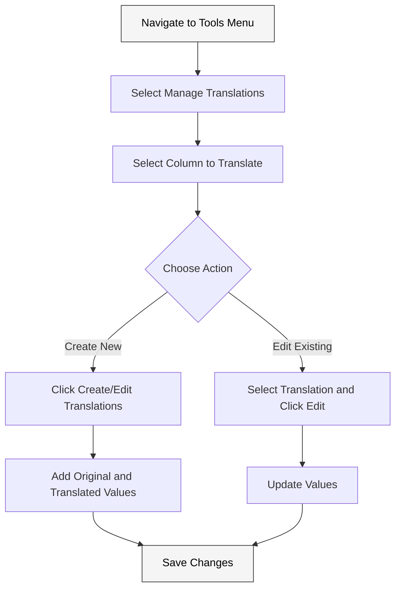

#### Flow 4: Configuring Rule Warnings
**Business Context:** This flow is triggered when the organization needs to adjust its risk tolerance for approaching regulatory thresholds. Business events that necessitate warning threshold configuration include:
- Implementation of new risk management policies
- Changes to regulatory thresholds in specific jurisdictions
- Adoption of more conservative compliance monitoring approaches
- Prior incidents of missed filings leading to enhanced monitoring
- New investment strategies with higher position velocity
- Feedback from compliance officers about alert frequency
- Internal audit recommendations for compliance monitoring
- Expansion into highly regulated markets requiring earlier warnings
- Changes in filing deadlines requiring longer preparation time
- Organizational restructuring affecting review and approval processes

**Description:** Process for setting up warning thresholds for rules to provide early notifications before threshold breaches.

**Steps:**
1. Navigate to Tools menu
2. Select "Rule Warning Maintenance"
3. Locate the desired rule
4. Click "Edit warnings" for that rule
5. In the Rule Warning adjustments screen:
   - Use default values if desired
   - Manually adjust individual thresholds
   - Use "Increase all" or "Decrease all" for batch adjustments
6. Click "Save changes" to apply the configuration

**User Dependencies (Information/Preparation Required):**
- Knowledge of regulatory thresholds for each rule
- Understanding of organizational risk tolerance
- Appropriate warning buffer requirements
- Internal policies for early warning notifications
- Authorization to modify warning thresholds

**System Dependencies:**
- Warning threshold configuration module
- Administrative permissions
- Rule engine integration
- Threshold validation system
- Configuration persistence

**Technical Considerations:**
- Warning threshold storage
- Impact on alert generation
- Validation of threshold values
- Relationship to regulatory thresholds

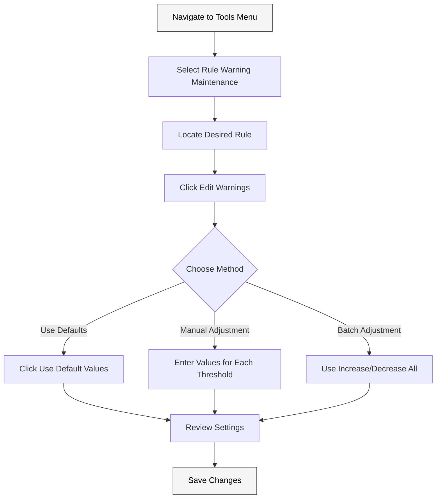

#### Flow 5: Setting Up Email Notifications
**Business Context:** This flow is triggered when the organization needs to establish or modify automated communication channels for compliance alerts. Business events that prompt email notification configuration include:
- Changes to compliance team structure or responsibilities
- Implementation of specialized monitoring for certain jurisdictions
- Establishment of dedicated teams for specific filing types
- Creation of escalation paths for high-priority filing obligations
- Reorganization of compliance oversight responsibilities
- Inclusion of legal department in specific notification types
- Implementation of backup monitoring during staff absences
- Creation of separate notification paths for different fund families
- Regional team structure requiring geography-specific notifications
- Implementation of 24-hour monitoring across global offices

**Description:** Process for configuring automated email notifications for specific events or alerts.

**Steps:**
1. Navigate to Tools menu
2. Select "Notification Emails"
3. Click "Add New Notification"
4. Configure notification settings:
   - Select recipient(s)
   - Choose to include Warnings and/or Violations
   - Select jurisdiction(s)
   - Select rule type(s)
   - Set notification email subject
5. Save the notification configuration

**User Dependencies (Information/Preparation Required):**
- List of notification recipients and their roles
- Knowledge of which alerts need notifications
- Understanding of jurisdiction and rule type coverage
- Email subject line conventions
- Internal notification policies

**System Dependencies:**
- Email notification module
- Email delivery system integration
- Recipient management system
- Alert type classification
- Rule jurisdiction mapping
- Configuration persistence

**Technical Considerations:**
- Email integration and delivery
- Notification rule storage and processing
- Potential for duplicate notifications
- Email template management

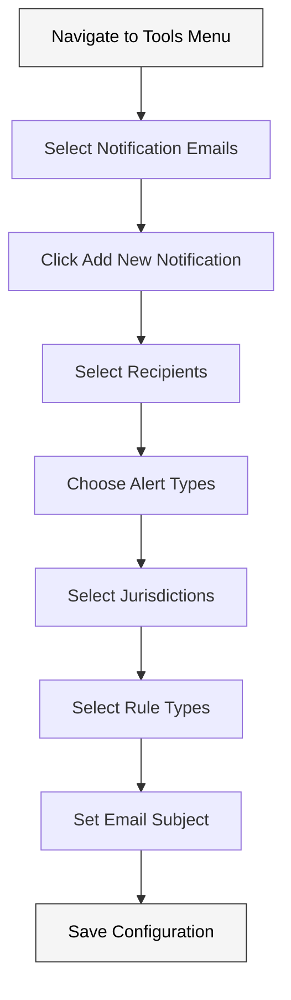

### Data Analyst / Operations Specialist Flows

#### Flow 1: Loading New Data
**Business Context:** This flow is triggered when new position or reference data needs to be imported into the system for analysis. Business events that necessitate manual data loading include:
- System failures in automated data feeds requiring manual intervention
- Ad-hoc analysis requests outside normal processing cycles
- Testing of data quality before scheduled processing
- Loading corrected historical data after identifying errors
- Special processing for unique transactions (corporate actions)
- Loading data for newly added funds or portfolios
- Performing retroactive analysis for compliance reviews
- Incorporation of manually collected data not in primary systems
- Pre-trade analysis for potential large positions
- Simulation of proposed trades for compliance pre-clearance

**Description:** Process for manually loading new data into the system for analysis.

**Steps:**
1. Navigate to My Data section
2. Click "Load New Data"
3. Click "Load New Data" again in the next screen
4. In the data loading window:
   - Select the "As Of Date" for the data
   - Select the CSV files to upload (Holdings, Constituents, FX Rates, Transactions)
   - Click "Load"
5. Wait for confirmation of successful loading
6. Verify data appears correctly in the system

**User Dependencies (Information/Preparation Required):**
- Properly formatted CSV files according to Signal requirements
- Knowledge of the correct "As Of Date" for the data
- Understanding of which files are required for processing
- Access to data source systems
- File preparation procedures and validation steps

**System Dependencies:**
- Data loading module
- File upload capability
- CSV parsing engine
- Data validation system
- Data storage mechanism
- Error reporting system

**Technical Considerations:**
- File upload capacity and performance
- Data validation during import
- Error handling for malformed data
- Impact on rule processing

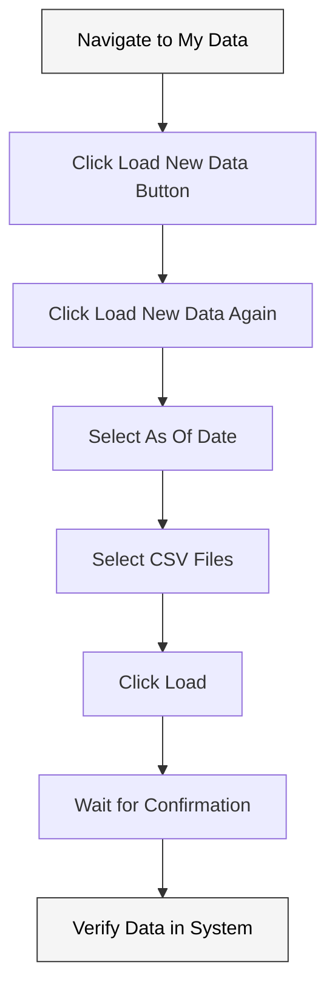

#### Flow 2: Running Ad-hoc Rule Analysis
**Business Context:** This flow is triggered when there's a need to evaluate data against specific rules outside the regular processing schedule. Business events that prompt ad-hoc rule analysis include:
- Urgent compliance inquiries from portfolio managers
- Regulatory inquiries requiring immediate position verification
- Pre-trade analysis for large potential investments
- Testing impact of proposed corporate actions
- Verification of previous analysis results
- Investigation of potential missed filings
- Analysis of positions after retrospective data corrections
- Due diligence activities during transactions
- Re-evaluation after rule changes or interpretations
- Training exercises for new compliance staff

**Description:** Process for triggering rule evaluation on specific data outside the regular processing schedule.

**Steps:**
1. Navigate to Alerts section
2. Click "Analyze My Data" button
3. In the analysis window:
   - Select the date of the data to analyze
   - Select the rule(s) to apply
   - Click "Analyze"
4. Wait for analysis to complete
5. Review generated alerts (if any)

**User Dependencies (Information/Preparation Required):**
- Knowledge of which rules need to be evaluated
- Understanding of which data dates to analyze
- Permission to run ad-hoc analysis
- Ability to interpret analysis results
- Knowledge of normal processing schedules

**System Dependencies:**
- Rule processing engine
- Data for the selected date must be loaded
- Rules must be properly configured
- Access control for Alerts section
- Analysis job queuing system

**Technical Considerations:**
- Rule processing performance
- On-demand processing queue management
- Alert generation and notification
- Impact on system resources

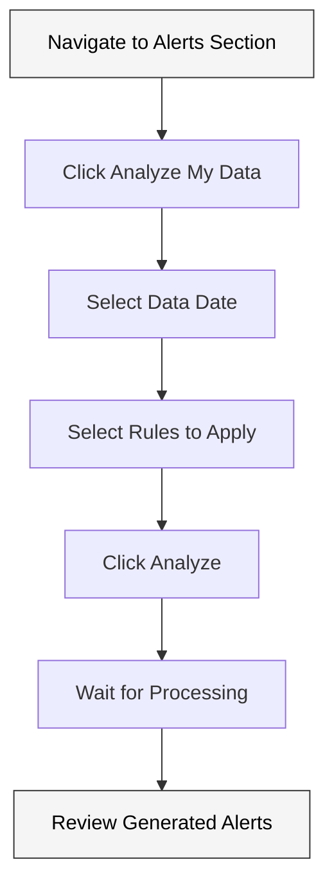

#### Flow 3: Previewing Data
**Business Context:** This flow is triggered when there's a need to examine holdings evaluated against rules, especially for verification or investigation purposes. Business events that necessitate data preview include:
- Verification of position calculations before filing decisions
- Investigation of why a specific alert was or wasn't triggered
- Responding to queries about specific securities or issuers
- Providing position data to legal or compliance teams
- Research on historical position patterns
- Quality assurance checks of processed data
- Supporting documentation for regulatory filings
- Preparation for compliance committee reviews
- Answering investment team questions about reported positions
- Cross-checking positions between multiple systems

**Description:** Process for viewing all holdings that were evaluated against a rule, regardless of whether they triggered an alert.

**Steps:**
1. Navigate to Alerts section
2. Click "Preview My Data" button
3. Select the desired rule and date
4. Review the data displayed
5. Export data to CSV if needed

**User Dependencies (Information/Preparation Required):**
- Knowledge of which rule to preview
- Understanding of which data date to analyze
- Ability to interpret displayed holdings data
- Knowledge of export requirements

**System Dependencies:**
- Data must be loaded for the selected date
- Rules must be configured
- Access control for Alerts section
- Data preview rendering system
- Export functionality

**Technical Considerations:**
- Data query performance
- Export functionality
- Display capacity for large datasets
- Filtering capabilities

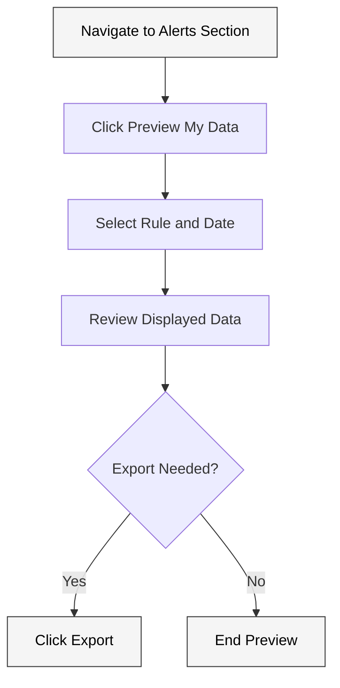

#### Flow 4: Investigating Exceptions
**Business Context:** This flow is triggered when the system identifies data quality issues that prevent proper rule evaluation. Business events that prompt exception investigation include:
- System alerts about missing or invalid data elements
- Unexpected calculation results requiring verification
- Missing market data for specific securities
- Failure to process certain positions during rule evaluation
- Inconsistencies between source data and processed results
- New security types not properly categorized
- Corporate actions affecting security identifiers
- Changes in exchange codes or instrument classifications
- Inconsistent reference data across multiple sources
- Data transformation errors during import processes

**Description:** Process for identifying and resolving data exceptions that prevent proper rule evaluation.

**Steps:**
1. Navigate to Alerts section
2. Look for Exception indicators (⚠️) in the Alert Type column
3. Click on the Exception indicator
4. Download the generated CSV file
5. Review the ErrorReason column to identify the cause
6. Correct the underlying data issue
7. Reload the corrected data
8. Re-run the rule analysis

**User Dependencies (Information/Preparation Required):**
- Understanding of data exception types and causes
- Access to source data systems for corrections
- Knowledge of data formatting requirements
- Ability to interpret error messages
- Permission to reload corrected data
- Knowledge of data interdependencies

**System Dependencies:**
- Exception detection and reporting system
- Access to Alerts section
- CSV generation functionality
- Error messaging system
- Data reload capability
- Rule re-processing functionality

**Technical Considerations:**
- Exception detection and reporting
- Error messaging clarity
- CSV generation for exceptions
- Re-processing workflow

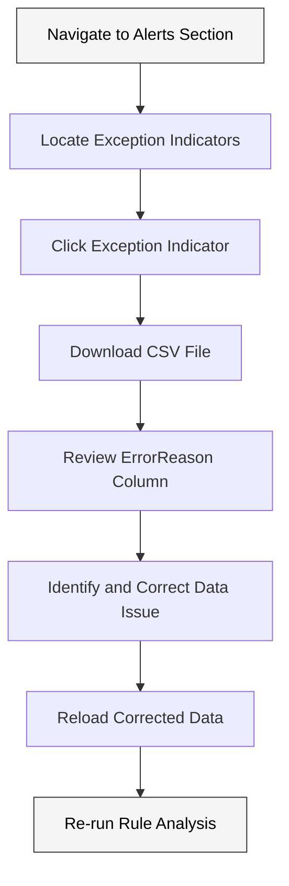

## 4. Potential Technical Debt Analysis

Based on the information provided in the PDF, here are potential areas of technical debt or complexity that may need evaluation:

### Data Integration and Mapping
- **Complexity**: The system requires precise mapping between client data structures and Signal's internal data model.
- **Potential Issues**: 
  - Manual mapping configuration is error-prone
  - Translation maintenance becomes complex as data sources evolve
  - Lack of automated validation for mappings
  - Limited documentation on required data formats

### Rule Processing Engine
- **Complexity**: The rule processing engine must evaluate holdings against complex regulatory thresholds across multiple jurisdictions.
- **Potential Issues**:
  - Performance degradation with large datasets
  - Difficulty in updating rules as regulations change
  - Complex aggregation logic that may be challenging to maintain
  - Limited transparency into rule evaluation logic

### Filing Generation Process
- **Complexity**: The system generates regulatory filings based on templates that must comply with jurisdiction-specific requirements.
- **Potential Issues**:
  - Template maintenance as regulatory forms change
  - Limited direct integration with regulatory submission systems
  - Potential for filing errors if templates are not updated

### Alert Management
- **Complexity**: The system must track and manage alerts through various states and user actions.
- **Potential Issues**:
  - Alert status tracking complexity
  - Potential for alert notification fatigue
  - Manual action requirements for each alert
  - Limited automation for routine actions

### Email Notification System
- **Complexity**: The system sends automated notifications based on configurable rules.
- **Potential Issues**:
  - Email delivery reliability
  - Notification configuration complexity
  - Risk of missing critical alerts if email fails
  - Lack of alternative notification channels

### User Interface
- **Complexity**: The UI must support various user roles and complex workflows.
- **Potential Issues**:
  - Multiple click paths required for common actions
  - Dense information displays that may be difficult to navigate
  - Limited mobile or responsive design
  - Potential for user confusion with complex state transitions

### Authentication and Authorization
- **Complexity**: The system must manage user access and permissions for sensitive compliance data.
- **Potential Issues**:
  - Granular permission management complexity
  - Potential for permission errors leading to unauthorized access
  - Limited audit trail for permission changes
  - User management overhead

### Data History and Versioning
- **Complexity**: The system must maintain historical data for compliance audit purposes.
- **Potential Issues**:
  - Storage requirements for historical data
  - Performance impact of historical queries
  - Limited purging or archiving capabilities
  - Complexity in viewing historical states

## 5. Conclusion

Signal is a sophisticated compliance management system designed to help financial institutions navigate complex regulatory requirements for substantial shareholding disclosure. The application provides robust capabilities for monitoring holdings, generating alerts, and facilitating regulatory filings.

The system serves multiple user personas, each with distinct needs and workflows. The complexity of these workflows, combined with the technical requirements for data integration, rule processing, and regulatory compliance, suggests areas where technical debt may accumulate over time.

Key areas for further evaluation include:
1. Data integration flexibility and resilience
2. Rule processing performance and maintainability
3. Filing generation accuracy and automation
4. Alert management efficiency and usability
5. System scalability for large data volumes
6. User experience optimization for common workflows

This analysis provides a foundation for more detailed technical assessments and potential modernization efforts to address identified complexities and potential technical debt.
